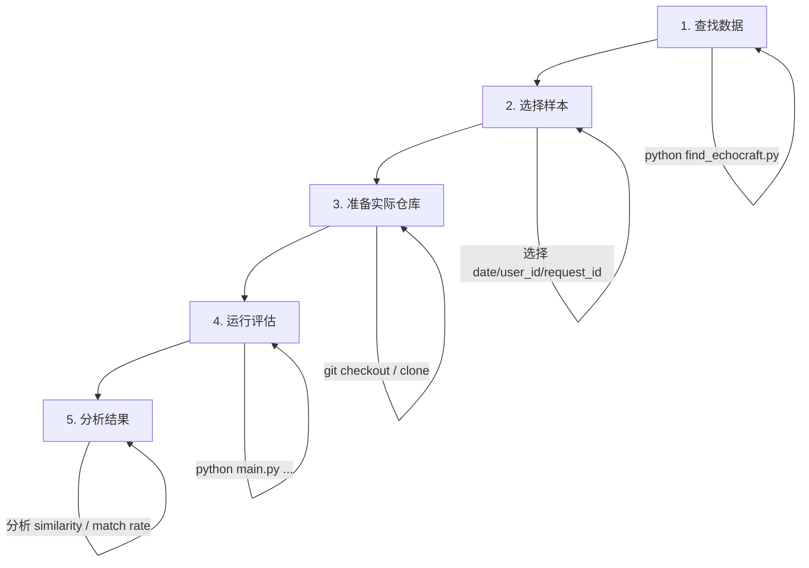

# EchoCraft 评估脚本工具集

本目录包含用于评估repo还原项目的质量评估的脚本工具集。
---

## 📁 目录结构

```
eval_script/
├── README.md                    # 本文档
├── find_echocraft.py            # 数据发现：查找包含 EchoCraft 的快照
├── git_pr_history.py            # Git 历史分析：查看仓库的 PR 和提交历史
├── echocraft_results.txt        # find_echocraft.py 的输出结果
├── git_pr_history_report.txt    # git_pr_history.py 的输出报告
├── result/                      # 评估结果输出目录
│   ├── visual/                  # HTML 可视化报告（按 user_id 分子目录）
│   └── diff_log/                # JSON 分析日志
└── repo_verify/                 # 仓库快照还原评估工具
    ├── main.py                  # 入口脚本（含 before/after 对比）
    ├── restore.py               # 快照还原模块
    ├── compare.py               # 仓库对比模块（含 before/after 对比逻辑）
    ├── visualize.py             # HTML 可视化报告生成模块
    ├── analyze_user_requests.py # 批量分析指定用户所有 request 的 diff 有效性
    └── readme.md                # repo_verify 详细设计文档
```

---

## 🔍 一、如何选用数据

### 1.1 数据源位置

EchoCraft 项目的快照数据存储在以下位置：

| 数据类型 | 路径 |
|---------|------|
| **快照文件** | `/data_fast_v2/dataset/agent/rl_edit/reposhot_event_output/repos/{日期}/{user_id}/{request_id}.jsonl` |
| **变更序列** | `/data_fast_v2/dataset/agent/rl_edit/reposhot_event_output/changes/{日期}/{user_id}/{request_id}/*.jsonl` |

### 1.2 查找可用数据

使用 `find_echocraft.py` 脚本查找所有包含 EchoCraft 关键字的快照数据：

```bash
cd /ai_train/bingodong/dhs/repo_evaluate/eval_script
python find_echocraft.py
```

**输出示例**：
- 匹配文件数：464 个
- 涉及用户数：10 个
- 按日期和用户分组的详细列表

### 1.3 数据格式说明

每条数据由 **日期**、**user_id**、**request_id** 三元组唯一标识：

| 字段 | 格式 | 示例 |
|------|------|------|
| `trigger_date` | YYYYMMDD | `20260204` |
| `user_id` | UUID | `2e1fb58b-ffa3-487f-86a6-eb613f42bc65` |
| `request_id` | 32位十六进制 | `258095388aed4db486b34d389861cd90` |

### 1.4 已知用户映射

根据 `echocraft_results.txt` 的分析结果，以下是主要用户的映射：

| user_id | 用户名 |
|---------|--------|
| `19802552-04bf-4173-acd4-bcbd25eaa9bd` | 永康 |
| `e6e42a7f-a0ee-4e29-8f63-f3faefc54e24` | haokunchen |
| `2e1fb58b-ffa3-487f-86a6-eb613f42bc65` | xwellxia |

### 1.5 选用数据的建议

1. **按用户筛选**：如果关注特定开发者的编辑行为，可根据 user_id 筛选
2. **按日期筛选**：评估特定时间段的数据质量
3. **样本选择**：建议从每个用户的数据中随机抽取若干样本进行评估

---

## 📊 二、如何进行评估

### 2.1 准备实际仓库

评估需要将还原的快照与**实际 Git 仓库**进行对比。

**方式 1：使用本地已有的 EchoCraft 仓库**

```bash
# 示例：使用本地仓库
actual_repo_path=/ai_train/bingodong/dhs/repo_evaluate/eval_data/EchoCraft
```

**方式 2：克隆远程仓库**

```bash
# 从远程仓库克隆（如果没有本地副本）
git clone <remote_url> /path/to/EchoCraft
```

**重要提示**：快照捕获的是用户**某一时刻的工作目录状态**，可能包含未提交的修改。如果要精确对比，需要将实际仓库切换到对应的 Git 版本。

### 2.2 单个快照评估

使用 `repo_verify/main.py` 评估单个快照：

```bash
cd /ai_train/bingodong/dhs/repo_evaluate/eval_script/repo_verify

python main.py \
    --trigger_date 20260204 \
    --user_id 2e1fb58b-ffa3-487f-86a6-eb613f42bc65 \
    --request_id 258095388aed4db486b34d389861cd90 \
    --actual_repo_path /ai_train/bingodong/dhs/repo_evaluate/eval_data/EchoCraft
```

**参数说明**：

| 参数 | 必填 | 说明 |
|------|------|------|
| `--trigger_date` | ✅ | 数据日期，格式 YYYYMMDD |
| `--user_id` | ✅ (单个模式) | 用户 UUID |
| `--request_id` | ✅ (单个模式) | 请求 ID |
| `--actual_repo_path` | ✅ | 实际仓库的本地路径 |
| `--reposhot_base` | ❌ | 快照文件根目录（有默认值） |
| `--changes_base` | ❌ | 变更文件根目录（有默认值） |
| `--html` | ❌ | 生成 HTML 可视化对比报告 |
| `--html_output` | ❌ | HTML 报告输出路径（默认自动生成） |

### 2.3 批量扫描评估

扫描指定日期下的所有快照并批量评估：

```bash
python main.py \
    --trigger_date 20260203 \
    --actual_repo_path /ai_train/bingodong/dhs/repo_evaluate/eval_data/EchoCraft \
    --scan
```

### 2.4 评估输出解读

**单个快照输出示例**：

```
================================================================================
Repo Comparison Report
================================================================================
Total files in restored repo: 20          # 还原出的文件总数
Matched in actual repo:       9           # 在实际 repo 中找到匹配的文件数
Missing in actual repo:       11          # 实际 repo 中不存在的文件数
Identical files:              7           # 内容完全一致的文件数
Different files:              2           # 内容有差异的文件数
Average similarity:           0.9714      # 匹配文件的平均相似度
```

**批量扫描汇总输出**：

```
================================================================================
SUMMARY: 10 repos compared
================================================================================
Total restored files:   200               # 所有快照的还原文件总数
Total matched:          150               # 总匹配数
Total identical:        140               # 总完全一致数
Total different:        10                # 总差异数
Total missing:          50                # 总缺失数
Overall avg similarity: 0.9500            # 整体平均相似度
```

### 2.5 Before/After 对比（Diff 有效性评估）

除了基本的还原 vs 实际对比，`main.py` 还会自动输出 **Before/After 对比报告**，用于评估 diff 变更是否让还原结果更接近真实仓库。

- **Before**：原始快照（应用 diff 之前）
- **After**：应用 diff 之后的还原结果
- **Actual**：真实 Git 仓库

**Before/After 输出示例**：

```
==========================================================================================
Repo Before/After Comparison Report
==========================================================================================
Files in before (snapshot):    20
Files in after  (restored):    21
  - Added by diff:             1
  - Removed by diff:           0
  - Modified by diff:          2
  - Unchanged by diff:         18
Missing in actual repo:        11

Before avg similarity to actual: 0.9650
After  avg similarity to actual: 0.9714
Similarity delta (after-before): +0.0064

Improved files  (after closer to actual): 2
Degraded files  (after farther from actual): 0
Unchanged similarity files:               1
```

**关键指标**：

| 指标 | 含义 |
|------|------|
| **Similarity delta** | `after_avg - before_avg`，正值表示 diff 有效提升了相似度 |
| **Improved files** | diff 后更接近真实仓库的文件数 |
| **Degraded files** | diff 后更远离真实仓库的文件数 |
| **Added/Modified/Removed by diff** | diff 对文件的操作分类 |

### 2.6 评估指标说明

| 指标 | 含义 | 理想值 |
|------|------|--------|
| **Matched Rate** | `matched / total` - 还原文件在实际 repo 中的匹配率 | 越高越好 |
| **Identical Rate** | `identical / matched` - 匹配文件中完全一致的比例 | 100% |
| **Average Similarity** | 匹配文件的平均文本相似度 (0~1) | 1.0 |
| **Missing in Actual** | 还原出但实际 repo 中不存在的文件数 | 0 |

### 2.7 HTML 可视化报告

`main.py` 和 `analyze_user_requests.py` 都支持生成 HTML 格式的可视化对比报告，方便直观地查看还原仓库与真实仓库的差异。

**使用方式**：

```bash
# 单个快照生成 HTML 报告
python main.py \
    --trigger_date 20260204 \
    --user_id 2e1fb58b-ffa3-487f-86a6-eb613f42bc65 \
    --request_id 258095388aed4db486b34d389861cd90 \
    --actual_repo_path /ai_train/bingodong/dhs/repo_evaluate/eval_data/EchoCraft \
    --html

# 批量生成 HTML 报告
python analyze_user_requests.py \
    --results_file /ai_train/bingodong/dhs/repo_evaluate/eval_script/result/echocraft_results.txt \
    --user_id 3ad75b0f-ce21-41c1-8ed1-3c54b9c1c84b \
    --actual_repo_path /ai_train/bingodong/dhs/repo_evaluate/eval_data/EchoCraft_aacedar \
    --html
```

**HTML 报告特性**：

| 特性 | 说明 |
|------|------|
| **左右对比视图** | 左边显示还原仓库内容，右边显示真实仓库内容 |
| **逐行 diff 高亮** | 修改、新增、删除的行用不同颜色标注 |
| **字符级 diff** | 对于修改的行，精确到字符级别的差异高亮 |
| **文件状态分类** | Identical（完全一致）、Different（有差异）、Missing（实际仓库中不存在） |
| **筛选和搜索** | 按状态筛选文件，按文件名搜索 |
| **展开/折叠** | 支持展开或折叠所有文件的详细内容 |

**报告显示范围**：

为减小 HTML 文件体积，报告**仅显示还原仓库中的文件及其在真实仓库中对应的文件**：
- ✅ 还原仓库中存在的文件（无论是否在真实仓库中存在）
- ✅ 真实仓库中与还原仓库文件对应的文件
- ❌ 仅在真实仓库中存在的文件（只统计数量，不显示详细内容）

**输出路径**：
- 默认输出到 `/ai_train/bingodong/dhs/repo_evaluate/eval_script/result/visual/`
- 批量分析时按 `user_id` 创建子目录
- 文件名格式：`diff_{request_id前12位}.html`

### 2.8 技术实现细节

#### 2.8.1 数据还原流程（restore.py）

还原过程分两步：**加载快照** + **按序应用 diff 变更**。

**Step 1：加载快照（`load_reposhot`）**

从 jsonl 文件读取仓库快照，数据结构如下：

```json
{
  "repo_name": "EchoCraft",
  "workspace_path": "/home/user/workspace/EchoCraft",
  "repo_infos": {
    "EchoCraft/src/main.py": "文件内容...",
    "EchoCraft/src/utils.py": "文件内容...",
    ...
  }
}
```

其中 `repo_infos` 是 `{文件路径: 文件文本内容}` 的字典，即快照时刻的完整文件系统状态。

**Step 2：加载变更序列（`load_changes`）**

从 `changes/{日期}/{user_id}/{request_id}/` 目录加载所有 `.jsonl` 文件，每条变更包含：

```json
{
  "timestamp": 1706959200,
  "results": [
    {
      "op_type": "edit",
      "file_path": "EchoCraft/src/main.py",
      "diff": "--- a/src/main.py\n+++ b/src/main.py\n@@ -10,3 +10,5 @@\n ..."
    }
  ]
}
```

变更按 `timestamp` 排序后逐条应用。

**Step 3：应用 diff（`reposhot_refresh` + `apply_diff`）**

对每条变更中的每个 result，按 `op_type` 执行不同操作：

| op_type | 操作 |
|---------|------|
| `delete` | 从 `repo_infos` 中删除该文件 |
| `update` / `edit` / `write` / `replace` | 取出基准内容，使用 `apply_diff` 应用 unified diff 补丁 |

`apply_diff` 的核心逻辑：
1. 将基准内容和 diff 文本分别按行拆分
2. 解析每个 hunk header（`@@ -start,count +start,count @@`），提取旧文件起始行号和行数
3. 遍历 diff 行：以空格开头的是上下文行（保留），以 `+` 开头的是新增行（加入），以 `-` 开头的是删除行（跳过）
4. 按 **从后往前** 的顺序（`reversed(hunks)`）将每个 hunk 的新行替换基准内容中的对应行段，避免行号偏移

最终得到 `after_infos`（应用所有 diff 后的文件内容字典）。

#### 2.8.2 路径前缀自动对齐（compare.py - `_detect_prefix`）

还原的文件路径可能带有仓库名前缀（如 `EchoCraft/src/main.py`），而实际仓库的文件路径是相对路径（如 `src/main.py`）。对齐方法：

1. 从还原 repo 的前 20 个文件路径中，拆分出候选前缀（取路径的前 1~2 层目录）
2. 同时将 `workspace_path` 的最后一级目录名加入候选
3. 加上空前缀 `""` 作为无前缀候选
4. 对每个候选前缀，统计去掉前缀后能在实际 repo 中匹配到多少文件
5. 选择 **匹配数最多** 的前缀作为最终前缀

#### 2.8.3 文件相似度计算（compare.py - `compute_similarity`）

使用 Python 标准库 `difflib.SequenceMatcher.ratio()`，基于 **Ratcliff/Obershelp 算法**：

```
similarity = 2.0 * M / T
```

- `M`：两个字符串中最长公共子序列的匹配字符数（递归查找）
- `T`：两个字符串的总字符数之和
- 结果范围：`[0.0, 1.0]`

**特殊处理**：
- 两段内容完全相同 → 直接返回 `1.0`（跳过计算）
- 两段内容都为空 → 返回 `1.0`
- 仅一方为空 → 返回 `0.0`

**注意**：这是 **字符级别** 的匹配，不是行级别。它会在整个文件文本上做序列匹配。

#### 2.8.4 基础对比流程（compare.py - `compare_repos`）

以还原 repo 为基准的 **单向对比**（不检查实际 repo 中多出的文件）：

```
对于还原 repo 中的每个文件：
  1. 去掉路径前缀得到 rel_path
  2. 在 actual_file_map 中查找 rel_path
     ├─ 找不到 → 标记为 missing_in_actual
     └─ 找到   → 计算 similarity = SequenceMatcher(还原内容, 实际内容).ratio()
                  ├─ similarity == 1.0 → identical
                  └─ similarity < 1.0  → different（附带 unified diff 预览）

avg_similarity = Σ(每个匹配文件的 similarity) / 匹配文件数
```

#### 2.8.5 Before/After 对比流程（compare.py - `compare_repos_before_after`）

三方对比：before（原始快照）、after（应用 diff 后）、actual（真实仓库）。

```
all_paths = before 的文件集 ∪ after 的文件集

对于每个文件路径：
  Step 1: 判断 diff 操作类型
    ├─ before 有 + after 有 + 内容相同 → unchanged
    ├─ before 有 + after 有 + 内容不同 → modified
    ├─ before 无 + after 有             → added
    └─ before 有 + after 无             → removed

  Step 2: 在 actual 中查找
    ├─ actual 中不存在 → missing_in_actual，跳过相似度计算
    └─ actual 中存在   → 继续 Step 3

  Step 3: 分别计算相似度
    before_sim = SequenceMatcher(before_content, actual_content).ratio()
    after_sim  = SequenceMatcher(after_content, actual_content).ratio()
    delta = after_sim - before_sim

  Step 4: 判断趋势（仅对 modified/added/removed 的文件）
    ├─ delta > 1e-6  → improved（diff 使文件更接近真实仓库）
    ├─ delta < -1e-6 → degraded（diff 使文件更远离真实仓库）
    └─ |delta| ≤ 1e-6 → no_change

汇总指标：
  before_avg_similarity = Σ(before_sim) / 匹配文件数
  after_avg_similarity  = Σ(after_sim)  / 匹配文件数
  avg_similarity_delta  = after_avg_similarity - before_avg_similarity
```

**对于特殊文件**：
- **added 文件**：`before_sim = 0.0`（before 中不存在），`after_sim` 正常计算
- **removed 文件**：`after_sim = 0.0`（after 中不存在），`before_sim` 正常计算
- **missing_in_actual 文件**：不参与相似度平均值计算

#### 2.8.6 指标计算公式汇总

| 指标 | 公式 | 说明 |
|------|------|------|
| **file_similarity** | `2.0 * M / T`（M=匹配字符数，T=总字符数） | 单个文件与真实文件的相似度 |
| **avg_similarity** | `Σ(similarity_i) / matched_count` | 所有匹配文件的平均相似度 |
| **before_avg_similarity** | `Σ(before_sim_i) / matched_count` | 应用 diff 前的平均相似度 |
| **after_avg_similarity** | `Σ(after_sim_i) / matched_count` | 应用 diff 后的平均相似度 |
| **avg_similarity_delta** | `after_avg - before_avg` | 正值=diff 有效 |
| **matched_rate** | `matched_files / total_restored_files` | 还原文件在实际 repo 中的覆盖率 |
| **identical_rate** | `identical_files / matched_files` | 完全一致的文件占比 |
| **improvement_rate** | `improved_requests / effective_requests` | 有效 diff 中提升相似度的比例（批量分析） |

---

## 🔬 三、批量分析用户请求的 Diff 有效性

### 3.1 功能说明

`analyze_user_requests.py` 用于遍历指定用户的所有 request，批量评估每次 diff 是否有效提升了仓库相似度。它会将所有 request 分为 5 类：

| 分类 | 含义 |
|------|------|
| **improved** | diff 使相似度提升（delta > 0） |
| **degraded** | diff 使相似度下降（delta < 0） |
| **no_sim_change** | diff 有实际修改但相似度未变 |
| **no_effective_diff** | diff 未产生任何有效文件变更 |
| **no_reposhot** | 找不到原始快照 |

### 3.2 使用方式

```bash
cd /ai_train/bingodong/dhs/repo_evaluate/eval_script/repo_verify

python analyze_user_requests.py \
    --results_file /ai_train/bingodong/dhs/repo_evaluate/eval_script/result/echocraft_results.txt \
    --user_id 3ad75b0f-ce21-41c1-8ed1-3c54b9c1c84b \
    --actual_repo_path /ai_train/bingodong/dhs/repo_evaluate/eval_data/EchoCraft_aacedar \
    --html
```

**参数说明**：

| 参数 | 必填 | 说明 |
|------|------|------|
| `--results_file` | ✅ | `echocraft_results.txt` 的路径 |
| `--user_id` | ✅ | 要分析的用户 UUID |
| `--actual_repo_path` | ✅ | 实际仓库路径 |
| `--reposhot_base` | ❌ | 快照文件根目录（有默认值） |
| `--changes_base` | ❌ | 变更文件根目录（有默认值） |
| `--output` | ❌ | 输出 JSON 路径（默认生成 `analysis_{user_id前8位}.json`） |
| `--html` | ❌ | 生成 HTML 可视化对比报告 |
| `--html_output_dir` | ❌ | HTML 报告输出目录（默认按 user_id 创建子文件夹） |
| `--json_output_dir` | ❌ | JSON 结果输出目录 |

### 3.3 输出说明

脚本会输出：
1. **逐个 request 的处理进度**
2. **汇总分类统计**（improved / degraded / no_sim_change / no_effective_diff / no_reposhot 各多少个）
3. **Improved 请求详情**（日期、请求ID、before/after 相似度、delta、变更文件列表）
4. **Degraded 请求详情**（同上）
5. **整体统计**（有效 diff 的平均 delta、改善率等）
6. **JSON 详细结果文件**（保存每个 request 的完整分析数据）

---

## 🛠 四、辅助工具

### 4.1 Git 历史分析

使用 `git_pr_history.py` 分析 Git 仓库的提交历史，帮助找到对应的版本：

```bash
# 查看最近 100 条提交
python git_pr_history.py /path/to/EchoCraft 100

# 按提交者筛选
python git_pr_history.py /path/to/EchoCraft --author=杨永康

# 列出所有提交者
python git_pr_history.py /path/to/EchoCraft --list-authors
```

**应用场景**：
- 找到快照对应的 Git commit
- 分析特定开发者的编辑模式
- 理解仓库的演化历史

### 4.2 版本对齐

如果发现还原快照与当前 repo 差异较大，可能需要对齐 Git 版本：

```bash
cd /path/to/EchoCraft

# 查看提交历史
git log --oneline -20

# 切换到特定版本
git stash                    # 保存本地修改
git checkout <commit_hash>   # 切换到目标版本
```

---

## 📋 五、评估流程总结



### 快速开始示例

```bash
# 1. 进入评估脚本目录
cd /ai_train/bingodong/dhs/repo_evaluate/eval_script

# 2. 查找可用数据（如果还没有运行过）
python find_echocraft.py

# 3. 查看数据列表
cat echocraft_results.txt

# 4. 选择一条数据进行评估
cd repo_verify
python main.py \
    --trigger_date 20260204 \
    --user_id 2e1fb58b-ffa3-487f-86a6-eb613f42bc65 \
    --request_id 258095388aed4db486b34d389861cd90 \
    --actual_repo_path /ai_train/bingodong/dhs/repo_evaluate/eval_data/EchoCraft

# 5. 或批量评估某天的所有数据
python main.py \
    --trigger_date 20260203 \
    --actual_repo_path /ai_train/bingodong/dhs/repo_evaluate/eval_data/EchoCraft \
    --scan

# 6. 批量分析某个用户所有 request 的 diff 有效性
python analyze_user_requests.py \
    --results_file /ai_train/bingodong/dhs/repo_evaluate/eval_script/result/echocraft_results.txt \
    --user_id 3ad75b0f-ce21-41c1-8ed1-3c54b9c1c84b \
    --actual_repo_path /ai_train/bingodong/dhs/repo_evaluate/eval_data/EchoCraft_aacedar \
    --html
```

