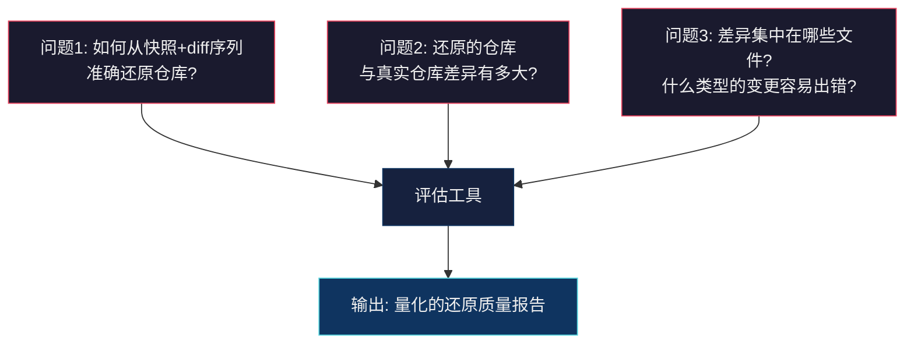
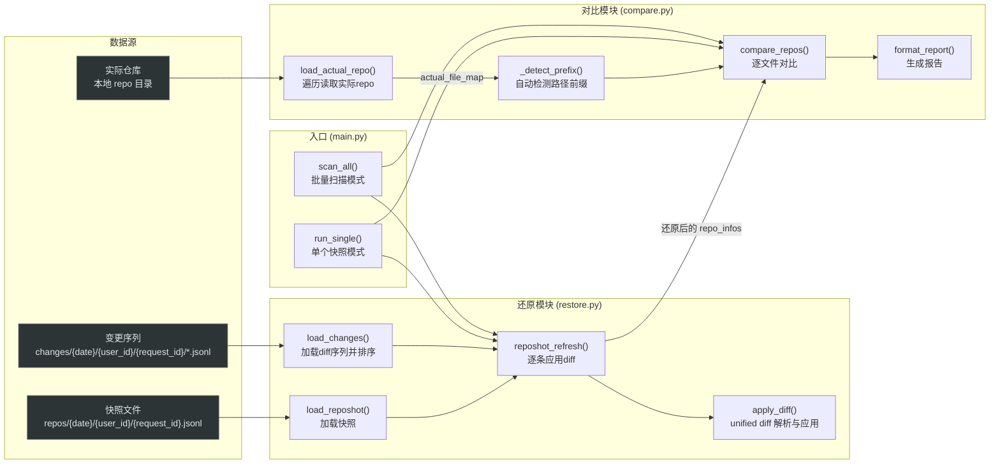

## Reposhot 还原评估工具 —— 设计方案

### 一、项目背景

**EchoCraft** 项目的核心目标是从用户历史操作数据中提炼知识，用于训练下一代 LLM。其中 `reposhot_restoration` 模块负责**捕获和还原代码仓库的快照**——即在某个时间点，系统记录一次完整的仓库快照（repo snapshot），之后通过增量记录用户的编辑操作（diff 变更序列），来追踪仓库的演化过程。

### 二、为什么要做这个评估工具

核心动机是回答一个关键质量问题：

> **"快照 + diff 变更序列"还原出来的仓库，与真实仓库之间到底有多大偏差？**

具体来说：

1. **数据采集链路的正确性验证**：`reposhot_restoration` 的数据采集链路包含多个环节——IDE 事件采集 → diff 生成 → 快照存储 → 变更记录存储。任何一个环节出现丢失、乱序、格式异常，都会导致最终还原结果不正确。需要一个端到端的评估手段来量化还原质量。

2. **diff 应用逻辑的准确性验证**：`apply_diff` 使用 unified diff 格式逐 hunk 应用变更（从后向前以避免行号偏移），这个过程依赖于 diff 格式的严格正确性和 hunk header 的准确解析。如果上游产生的 diff 有瑕疵（如行号偏移、缺失上下文行），会导致内容错位。

3. **为后续训练数据质量把关**：EchoCraft 使用这些还原后的仓库状态作为模型训练的上下文输入。如果还原出的仓库与真实仓库偏差过大，会直接影响训练数据质量，进而影响模型效果。因此需要量化衡量指标。

### 三、核心要解决的问题



| 问题 | 说明 |
|------|------|
| **还原准确性** | 快照加载 + diff 按时序应用后的仓库状态，能否忠实反映真实仓库？ |
| **差异定位** | 哪些文件出现了偏差？偏差程度多大？具体 diff 是什么？ |
| **路径映射** | 还原 repo 中的文件路径（可能带有 `repo_name/` 前缀）如何与实际 repo 的相对路径正确匹配？ |
| **批量评估** | 如何高效地对大量快照样本进行批量评估并汇总统计？ |

### 四、整体架构



### 五、怎么做 —— 详细设计

#### 5.1 还原模块 (`restore.py`)

**职责**：将离线存储的快照和 diff 序列重新组装成完整的仓库文件映射。

**数据格式**：
- **快照** (`repos/{date}/{user_id}/{request_id}.jsonl`)：单个 JSON 对象，核心字段为 `repo_infos: {file_path: content}`，另含 `repo_name`、`workspace_path` 等元信息。
- **变更序列** (`changes/{date}/{user_id}/{request_id}/*.jsonl`)：多个 JSONL 文件（每行一条记录），每条包含 `timestamp`、`results: [{op_type, file_path, diff}]`。

**核心流程**：

```
load_reposhot()          ─→ 读取快照，得到 t0 时刻的 repo_infos
         ↓
load_changes()           ─→ 读取所有变更文件，按 timestamp 升序排列
         ↓
reposhot_refresh()       ─→ 遍历每个 diff_item 的每个 result：
   ├── op_type=delete    ─→ 从 repo_infos 中删除该文件
   ├── op_type=update/edit/write/replace
   │       ↓
   │   apply_diff()      ─→ 解析 unified diff 的 hunk header，
   │                        从后向前替换 base_lines 对应区间
   └── 未知 op_type      ─→ 打印警告，跳过
```

**关键设计决策**：
- `apply_diff` 从后向前（`reversed(hunks)`）应用 hunk，避免前面 hunk 的替换导致后续 hunk 行号失效——这与原始 `diff.py` 的逻辑完全一致。
- 兼容两种目录结构（有/无 `user_id` 子目录），增强鲁棒性。

#### 5.2 对比模块 (`compare.py`)

**职责**：将还原后的仓库与磁盘上的真实仓库做逐文件对比，输出量化指标。

**核心流程**：

```
load_actual_repo()       ─→ os.walk 遍历实际 repo，读取所有文本文件
         ↓
_detect_prefix()         ─→ 采样还原 repo 的前 20 个文件路径，
                            枚举候选前缀（前1~2层目录），
                            选择使采样文件在 actual_repo 中匹配最多的前缀
         ↓
compare_repos()          ─→ 以还原 repo 为基准遍历每个文件：
   ├── 去前缀后在 actual 中找不到 ─→ missing_in_actual
   ├── 找到且内容完全一致         ─→ identical
   └── 找到但内容不同             ─→ different，算 SequenceMatcher 相似度
         ↓
format_report()          ─→ 文本报告：总数/匹配数/相同/差异/缺失/平均相似度
```

**关键设计决策**：
- **自动前缀检测**：还原 repo 的文件路径通常是 `workspace_path` 下的绝对路径片段（如 `EchoCraft/src/main.py`），而实际 repo 的相对路径是 `src/main.py`。通过采样 + 枚举候选前缀 + 计数匹配的策略，自动找到最优前缀映射，无需手动指定。
- **以还原 repo 为基准**：只对比还原 repo 中出现的文件，不关心实际 repo 中多出的文件（因为我们关注的是"还原出的内容是否正确"，而非"是否遗漏了文件"）。
- **相似度指标**：使用 `difflib.SequenceMatcher.ratio()` 计算 0~1 的相似度，直观反映偏差程度。

#### 5.3 入口模块 (`main.py`)

**两种运行模式**：

| 模式 | 参数 | 行为 |
|------|------|------|
| **单个模式** | `--user_id` + `--request_id` | 还原指定快照，与 `--actual_repo_path` 对比 |
| **扫描模式** | `--scan` | 遍历 `--trigger_date` 下所有快照，逐个还原并对比，输出汇总报告和 `results.json` |

扫描模式下，实际 repo 只加载一次，避免重复 IO。

### 六、输出物

1. **终端报告**：每个快照的对比结果，包含文件总数、匹配数、相同数、差异数、缺失数、平均相似度，以及差异文件的 unified diff 预览。
2. **汇总统计**：扫描模式下，所有快照的聚合统计（总文件数、总匹配、总相同、总差异、总缺失、整体平均相似度），以及每个 repo 的单行概要。
3. **结构化结果** (`results.json`)：JSON 格式保存所有对比详情，便于后续分析和可视化。

### 七、使用方式

```bash
# 单个快照评估
python main.py \
    --trigger_date 20260203 \
    --user_id 00476bdd-44f0-488c-b094-48f3edbdc35f \
    --request_id 420f8a6f33e640d7938a8eef366e54e8 \
    --actual_repo_path /data_fast_v2/changqingai/workspace_code/for_agent_model/EchoCraft

# 批量扫描评估
python main.py \
    --trigger_date 20260203 \
    --actual_repo_path /data_fast_v2/changqingai/workspace_code/for_agent_model/EchoCraft \
    --scan
```

---
